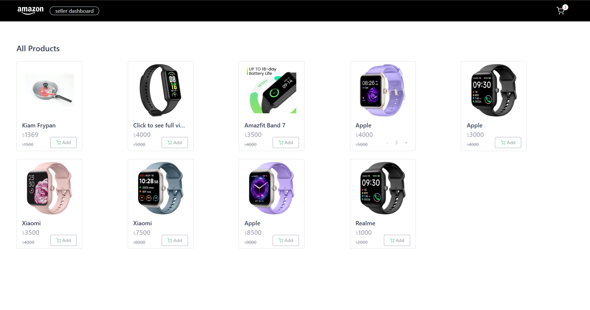
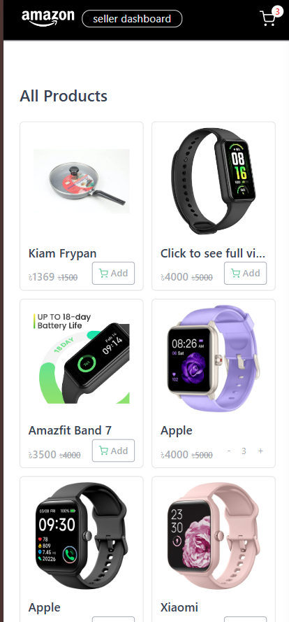

# Qtec Assignment – E-commerce Demo

This project is a full-stack e-commerce demo built with **React (Vite)** for the frontend and **Express.js** for the backend. The backend is deployed on **Vercel** and uses **MongoDB** and **Cloudinary** for data and image storage. The frontend is styled with **Tailwind CSS** and supports product browsing, cart management, and a seller dashboard.

---


## Features

- Product listing and details
- Add/remove products to/from cart
- Cart sidebar with order summary
- Checkout modal
- Seller dashboard for adding products (with image upload)
- Responsive UI with Tailwind CSS
- Toast notifications for user feedback
- Backend API with Express, MongoDB, and Cloudinary
- CORS configured for local and deployed environments

---


---

## Getting Started

### Prerequisites

- [Node.js](https://nodejs.org/) (v18+ recommended)
- [npm](https://www.npmjs.com/) or [yarn](https://yarnpkg.com/)
- [MongoDB Atlas](https://www.mongodb.com/cloud/atlas) account
- [Cloudinary](https://cloudinary.com/) account

---

### 1. Backend Setup

1. **Install dependencies:**
   ```sh
   cd server
   npm install
# Configure environment variables:
Create a .env file in the server/ directory:

MONGODB_URL=your_mongodb_connection_string
PORT=4000

# Cloudinary
CLOUDINARY_CLOUD_NAME=your_cloud_name
CLOUDINARY_API_KEY=your_api_key
CLOUDINARY_API_SECRET=your_api_secret

# Run locally:

npm run server

----------------------------------------------------

### 2. Frontend Setup
  ```sh
  cd client
  npm install

### Configure environment variable: 
VITE_BACKEND_URL="https://localhost:4000" 

### Run locally
npm run dev